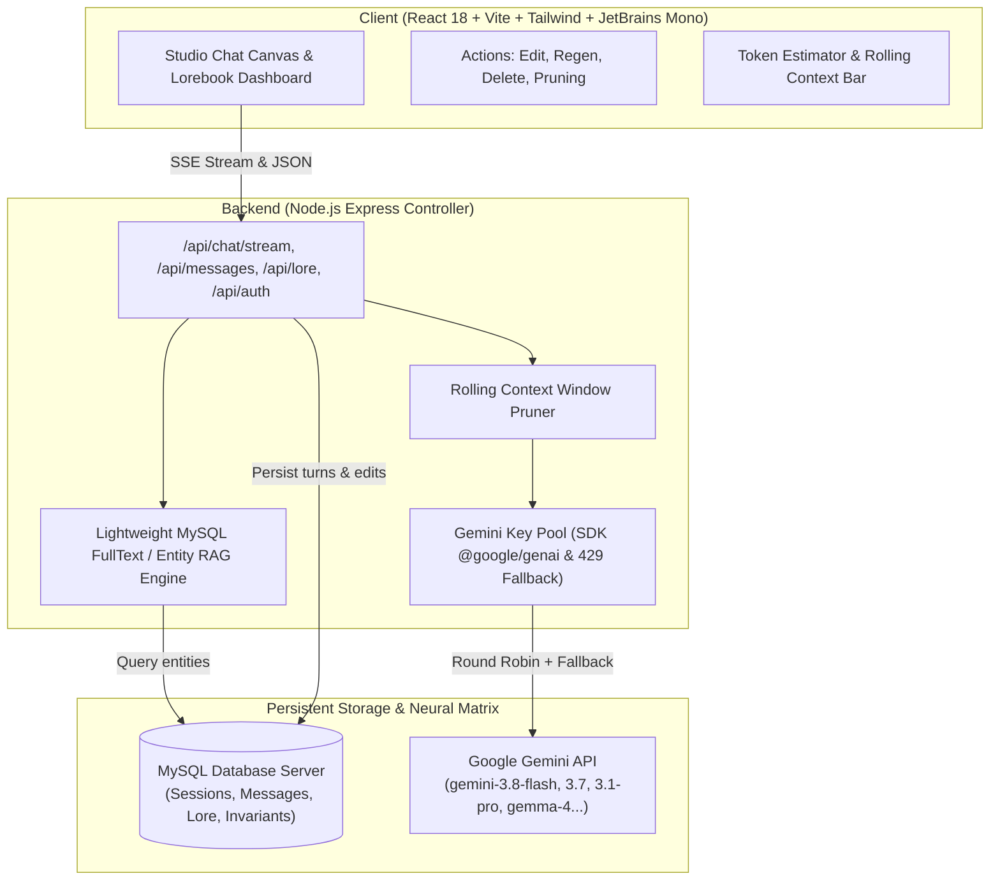

# 🌌 INTPcrafter // StoryContainer Engine

<p align="center">
  
  
  
  
  
</p>

> **"Tôi không bị điên, tôi chỉ đang mô phỏng lại một thực tại khác mà ở đó logic không bao giờ sụp đổ."**  
> — *Một dev INTP 5w4 lúc 3h47 sáng sau khi uống 3 lon Monster Energy.*

---

## 🍵 Lời Tự Thú Đầu Tiên Của Tác Giả

Chào mọi người, tui là cái thằng code đều đây. 

Nói thật lòng thì cái repo này sinh ra **chỉ để thỏa mãn ảo tưởng của tôi thôi**. Là một thằng INTP 5w4 chính hiệu, tôi mắc chứng bệnh nan y mang tên: *nghiện overthinking và hoang tưởng xây dựng thế giới (worldbuilding)*. Tôi không thể chịu nổi mấy con AI viết truyện nửa chừng bị lú, nhân vật chết rồi tự nhiên sống lại, hay thế giới fantasy ma pháp mà không tuân theo định luật bảo toàn năng lượng và nhân quả luận (causality).

Thế là tôi đập bàn, bật nhạc Synthwave và code ra con hàng này: **INTPcrafter** (tên mã: **StoryContainer Engine**). Một cỗ máy giả lập tiểu thuyết siêu cấp vô địch vũ trụ kết hợp giữa sự thực dụng của **Novelcrafter** và độ linh hoạt của **Google AI Studio**.

---

## ⚡ Thì các tính năng của nó có là...

Dưới đây là danh sách những thứ mà tôi đã nhét vào để phục vụ cho sự ảo tưởng đỉnh cao của bản thân:

### 1. 💅 Font chữ & Giao diện "Chữa lành cận thị"
- **Đồng bộ 100% `JetBrains Mono`**: Từ cái tiêu đề, nội dung chat, đến cái nhãn nút bấm nhỏ nhất cũng phải là JetBrains Mono. Tôi dị ứng với font chữ uốn éo bo tròn của mấy ông designer. Lập trình viên viết truyện thì chữ nó phải vuông vức, thẳng thớm và đậm mùi terminal.
- **Cyberpunk Dark Mode & Kính mờ (Glassmorphism)**: Tông nền đen tuyền (`#020617`), viền neon xanh Cyan (`#00f0ff`) phát sáng trong bóng đêm. Giúp anh em ngồi cày truyện lúc nửa đêm không bị đui mắt mà trông vẫn như hacker trong phim viễn tưởng.

### 2. 🎛️ Bộ nút bấm thao túng thời gian (Google AI Studio Action Bar)
- **Nút Sửa Prompt (`Edit3`)**: Cho phép người dùng bấm vào sửa lại lời nói của mình trong quá khứ.
  - *Lưu lại*: Chỉ lưu vào DB cho đẹp mặt, không làm phiền AI.
  - *Lưu & Chạy lại (Submit)*: Xóa sạch toàn bộ tương lai phía sau, gửi lại prompt mới toanh để AI viết lại dòng thời gian khác (đa vũ trụ canon).
- **Nút Chạy lại (`Regen RotateCcw`)**: Mỗi khi AI nói câu gì ngáo ngơ, không đúng với ý đồ vĩ đại của bạn, hãy bấm một phát. Hệ thống sẽ tự động chém bay phản hồi cũ trong MySQL và ép AI vắt óc suy nghĩ lại từ đầu.
- **Nút Xóa Prompt (`Trash2`)**: Xóa thẳng tay không thương tiếc. Mọi dấu vết tội lỗi hay prompt nhảm nhí sẽ bốc hơi khỏi MySQL trong một nốt nhạc, đồng thời thanh tính Token tự co giãn lại.

### 3. 🧠 Thẻ bóc trần suy nghĩ của AI (`<thinking>`)
- AI bây giờ khôn lắm, nói một đằng nghĩ một nẻo. Vì vậy tôi bắt mô hình phải ói ra thẻ `<thinking>...</thinking>` trước khi viết truyện.
- Hệ thống sẽ tách riêng suy nghĩ của AI vào một **Thẻ Terminal INTP Cognitive Trace**. Bạn có thể bấm thu gọn hoặc mở ra xem AI đang tính toán logic, phân tích tâm lý nhân vật hay đang ngầm chửi rủa prompt của bạn.

### 4. 📐 Nhồi nhét Toán học & Vật lý với LaTeX (KaTeX)
- Đã là INTP thì viết tiểu thuyết tiên hiệp hay sci-fi cũng phải lôi công thức toán vào cho nó nguy hiểm.
- Hệ thống hỗ trợ render LaTeX thời gian thực bằng `remark-math` và `rehype-katex`. Gõ `$E = mc^2$` hay `$$\oint \vec{B} \cdot d\vec{A} = 0$$` thì chữ hiện lên mượt mà như sách giáo khoa đại học.

### 5. 🌊 Hiệu ứng gõ chữ thời gian thực (Real-time Typing Token Stream)
- Tích hợp chuẩn **Server-Sent Events (SSE)**.
- Từng token của AI tuôn ra màn hình kèm con trỏ nhấp nháy `█`, tạo cảm giác như một thực thể số học đang gõ phím trực tiếp nói chuyện với bạn chứ không phải là đống JSON khô khan.

### 6. 🧹 Tối ưu hiệu năng DOM Pruning (Học lỏm từ `chat.gemini.com`)
- Khi viết truyện dài cả trăm chap, DOM của trình duyệt sẽ phình to như bụng ông chú bụng bia và lag lòi mắt.
- Cơ chế Chat Pruning sẽ tự động giấu bớt các tin nhắn cũ phía trên (mặc định giữ 12 turns gần nhất trên màn hình để scroll 120fps siêu mượt). Muốn xem lại chỉ cần bấm nút `[Tải thêm +10]` hoặc `[Hiện tất cả]`.

### 7. 🎚️ Thanh đo Token & Núm xoay Cuộn Ngữ Cảnh (Rolling Context Window)
- Có đồng hồ đo Token thời gian thực và % dung lượng bộ nhớ của từng model.
- Kèm theo **Thanh trượt Context Rolling**: Bạn có thể kéo thả để quy định đạt bao nhiêu token thì hệ thống tự động "cắt tỉa" lịch sử cũ, chỉ giữ lại kiến thức cốt lõi và các lượt chat gần nhất để chống lú (hallucination) cho AI và tiết kiệm tiền.

### 8. 📚 RAG Lorebook kết nối trực tiếp MySQL
- Tự động bắt từ khóa (entity titles & aliases) trong prompt để truy vấn fulltext từ bảng `lore_entries` của MySQL.
- Bơm thẳng thông tin nhân vật, hệ thống ma pháp, địa danh và quy tắc bất biến vào System Prompt trước khi AI kịp bịa chuyện.

### 9. 🗝️ Bể chứa Key Gemini luân chuyển (Key Pool Du kích)
- Quản lý từ 5 đến 10 API Key Google Gemini chạy qua `@google/genai` mới nhất.
- Tự động phát hiện lỗi `429 Too Many Requests`. Nếu key này hết quota, nó sẽ tự động đá bóng sang key tiếp theo mà không làm gián đoạn câu văn đang viết dở.

### 10. 🚪 Panel Đăng Nhập Dev Matrix Bảo Mật "Cấp Mẫu Giáo"
- Một modal đăng nhập kính mờ chuẩn cyberpunk cho nó chuyên nghiệp.
- **Tài khoản mặc định**:
  - ID / Tài khoản: `0` (hoặc `dev`)
  - Mật khẩu: `0000`
- Có cả nút bấm **"Quick Dev Login"** để tự điền và đăng nhập trong 0.1 giây. Hiển thị badge Dev phát sáng xanh lè trên thanh Navbar.

---

## 🏛️ Kiến Trúc Hệ Thống (INTP Neuro-Matrix)



---

## 🚀 Danh Sách Model Hợp Lệ

Hệ thống chỉ tích hợp những model Gemini & Gemma mới nhất theo chuẩn API hiện tại:

| Tên Model | Cửa sổ ngữ cảnh (Tokens) | Mục đích sử dụng |
| :--- | :--- | :--- |
| `gemini-3.8-flash` | 1,048,576 | Viết lách tốc độ bàn thờ, suy luận siêu nhanh (Mặc định) |
| `gemini-3.7-flash` | 1,048,576 | Cân bằng hoàn hảo giữa tốc độ và chiều sâu văn học |
| `gemini-3.6-flash` | 1,048,576 | Dự phòng tác chiến khi 3.8 quá tải |
| `gemini-3.5-flash-lite` | 1,048,576 | Siêu nhẹ, siêu tiết kiệm quota |
| `gemini-3.1-pro` | 2,097,152 | Bộ não quái vật, logic chặt chẽ cho các cảnh hack não |
| `gemini-2.5-pro` | 2,097,152 | Phân tích lore phức tạp, lập dàn ý nhiều tầng |
| `gemini-2.5-flash` | 1,048,576 | Model cày cuốc đáng tin cậy |
| `gemma-4-31b-it` | 131,072 | Mã nguồn mở mãnh liệt, văn phong tự nhiên |
| `gemma-4-26b-a4b-it` | 131,072 | Nhỏ gọn, phản hồi tức thì |

*(Mấy con 1.5 đồ cổ Google khai tử rồi nên tôi xóa sổ không cho xuất hiện ở đây nữa).*

---

## 🛠️ Hướng Dẫn Cài Đặt (Cho anh em nào cũng rảnh như tôi)

### 1. Kéo repo về máy:
```bash
git clone https://github.com/PhucERRscrtcodebruhh/INTPcrafter.git
cd INTPcrafter
```

### 2. Cài đặt các gói phụ thuộc:
```bash
npm install
```

### 3. Chạy kiểm thử sanity test:
```bash
npm test
node tests/messages_auth.test.js
```

### 4. Khởi động cỗ máy giả lập:
```bash
npm run dev
```

- Mở trình duyệt truy cập: `http://localhost:5173`
- Đăng nhập bằng tài khoản: ID `0` (hoặc `dev`), mật khẩu: `0000`
- Bấm phím tắt `Ctrl + K` (hoặc `Cmd + K`) để chuyển đổi qua lại giữa phòng viết truyện và kho lưu trữ Lorebook.

---

## 📜 Lời Kết Của Một Dev INTP 5w4

Cuộc đời này ngắn ngủi và đầy rẫy sự vô lý. Nếu thực tại không như bạn mong muốn, hãy tự code ra một vũ trụ của riêng mình mà ở đó bạn là Đấng Sáng Thế nắm quyền kiểm soát từng dòng code, từng token, và từng nhánh rẽ thời gian.

Chúc anh em thẩm du tư tưởng vui vẻ với **INTPcrafter**! ⭐ Đừng quên tặng 1 star trên GitHub để tôi bớt cảm thấy cô độc giữa vũ trụ này.
